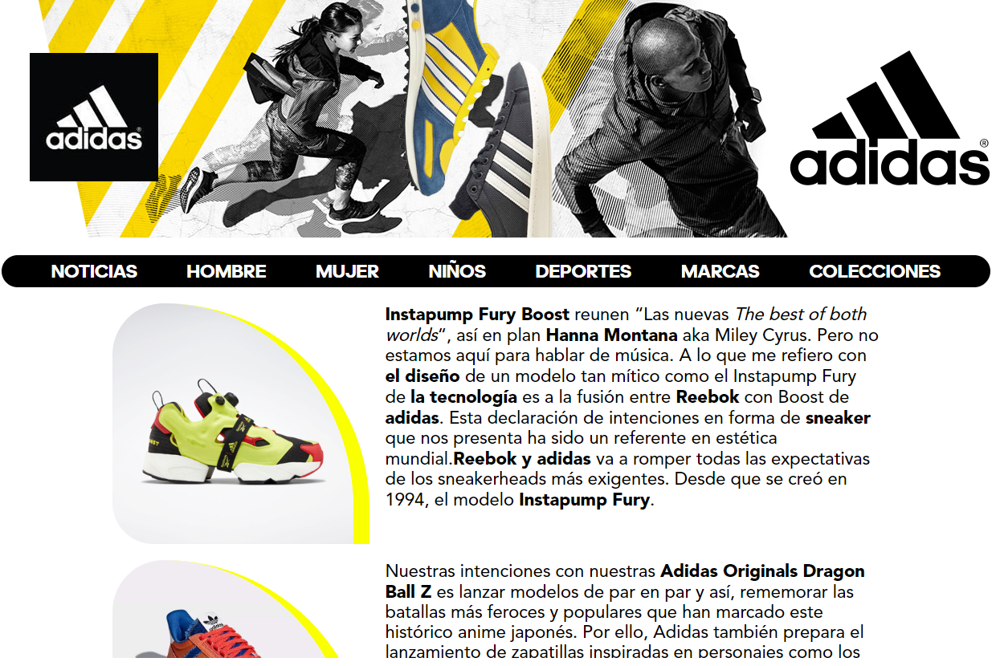

# **Grid Store**

Web Application that simulates being the portal of an Adidas Store 🛍️

## **Table of contents**

- [**Grid Store**](#grid-store)
  - [**Table of contents**](#table-of-contents)
  - [**General info**](#general-info)
  - [**Demo**](#demo)
  - [**Screenshots**](#screenshots)
  - [**Technologies**](#technologies)
  - [**Setup**](#setup)
  - [**Usage**](#usage)
  - [**Status**](#status)
  - [**Contact**](#contact)

## **General info**

**Date**: October, 2019  
**Duration**: 2 Days.

It was an exercise to practice **GRID** from **CSS** using the basics to paint a responsive design website without external libraries. I have used to practice **CSS**.

## **Demo**

You can try it using the [Demo](https://udsgit.github.io/grid-store).

> <br><i>Demo</i>

## **Screenshots**

> <br><i>Home</i>

## **Technologies**

- **Html**
- **Css**&nbsp;&nbsp;_(Grid)_
- **JavaScript**&nbsp;&nbsp;_(Just a little)_

## **Setup**

It has no installation, you just need to clone or download the repository.

```console
git clone https://github.com/udsgit/grid-store.git
```

## **Usage**

1. Open the link from the [Demo](https://udsgit.github.io/grid-store) or open the file **index.html** if you downloaded it.
2. The only interaction it has are the links and CSS effects.

## **Status**

Project is: **_Completed._**

Because the functionality was to practice with **Grid**.

## **Contact**

Created by [@Emmanuel](https://www.linkedin.com/in/emagleza/), feel free to contact me!
